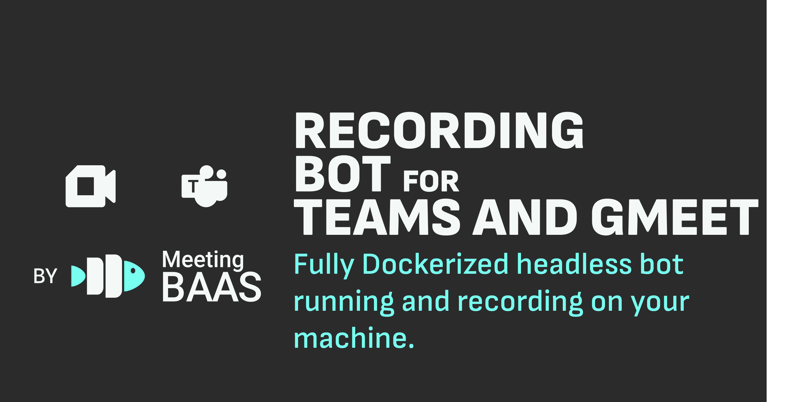

<p align="center"><a href="https://discord.com/invite/dsvFgDTr6c"></a>

<p align="center">
  <b>🚀🐟 Help us reach 50 stars! 🐟🚀</b><br>
  <b>Current:  → Goal: 50 ⭐️</b><br>
  <a href="https://github.com/Meeting-BaaS/meet-teams-bot/stargazers">⭐ Star this repo to support the project!</a>
</p>

[](./run_bot.sh) [](./run_serverless.sh)

# Meet Teams Bot: Self-Hostable Meeting Recording Engine
[](https://meetingBaaS.com)

The **open-source core bot engine** that powers [**Meeting BaaS** (Meeting **B**ots **a**s **a** **S**ervice)](https://meetingBaaS.com) - a production-ready, self-hostable TypeScript bot for automated meeting recording and transcription on **Google Meet** and **Microsoft Teams**.

**🎯 Privacy-first, open-source alternative to Recall.ai's bot functionality**

## 🚀 Build Meeting Intelligence. In Hours, Not Months.

Deploy your own meeting bots and start capturing meeting data **immediately**. This is the same battle-tested engine that powers thousands of meeting recordings in production.

### ⚡ **Get Started in 3 Commands**
```bash
# 1. Build the bot
./run_bot.sh build

# 2. Run with your meeting (using actual Meeting BaaS API format)
./run_bot.sh run-json '{
  "meeting_url": "https://meet.google.com/abc-def-ghi",
  "bot_name": "My Recording Bot",
  "user_token": "your-jwt-token",
  "bots_api_key": "your-api-key",
  "recording_mode": "SpeakerView",
  "bots_webhook_url": "https://your-webhook.com/webhook"
}'

# 3. Access your recordings
ls ./recordings/
```

**Perfect for developers building:** AI Meeting Assistants • Vertical SaaS • Developer Tools • Meeting Intelligence Platforms

## 🎯 Who This Is For

This open-source meeting bot engine is designed for **technical teams** who need:

### 🤖 **AI Meeting Assistant Builders**
Deploy bots to capture raw video, audio, and transcript data from Google Meet and Teams meetings. Build intelligent assistants with complete meeting context and participant metadata.

### 🏢 **Vertical SaaS Developers**
Embed meeting recording capabilities directly into your industry-specific solution. Get complete control over the bot behavior, data pipeline, and user experience.

### 🛠️ **Developer Tool Creators**
Build IDE plugins, workflow automations, or productivity tools that need meeting data. Access speaker detection, timing information, and real-time webhooks.

### 📊 **Meeting Intelligence Platforms**
Create analytics and insights on customer conversations or team meetings. Self-host for complete data sovereignty and custom processing pipelines.

## ✨ The Open Source Advantage

### 🚀 **Start Fast, Scale Your Way**
- **Hosted API First**: Begin with [MeetingBaaS API](https://meetingBaaS.com) for instant integration (1 API call to deploy bots)
- **Self-Host When Ready**: Deploy this engine on your infrastructure with full control
- **No Vendor Lock-In**: Your data, your code, your choice

### 🔒 **Enterprise-Grade Control**
- **GDPR Compliant**: Full data sovereignty when self-hosted
- **Custom Processing**: Modify transcription, recording, and webhook logic
- **Source Transparency**: Audit, extend, and customize the entire bot pipeline

### 💪 **Production Battle-Tested**
- **Thousands of recordings** processed in production
- **Sophisticated error recovery** for real-world meeting scenarios
- **Optimized performance** for resource-constrained environments

## 🚀 Quick Start with Docker

### Prerequisites
- Docker installed on your system
- Meeting URL (Google Meet or Microsoft Teams)

### Simple Example

**1. Create your bot configuration:**
```json
{
    "meeting_url": "https://meet.google.com/your-meeting-url",
    "user_token": "your-jwt-token-here",
    "bots_api_key": "your-api-key-here",
    "bot_name": "My Recording Bot",
    "speech_to_text_provider": "Default",
    "bots_webhook_url": "https://your-webhook-url.com/webhook",
    "bot_uuid": "unique-bot-identifier",
    "recording_mode": "SpeakerView",
    "mp4_s3_path": "recordings/output.mp4",
    "custom_branding_bot_path": "https://your-domain.com/path/to/branding-image.jpg",
    "automatic_leave": {
        "waiting_room_timeout": 60,
        "noone_joined_timeout": 60
    },
    "enter_message": "Recording bot has joined the meeting",
    "secret": "your-secret-key"
}
```

**2. Deploy the bot:**
```bash
# Build once
./run_bot.sh build

# Run with config file
./run_bot.sh run params.json

# Or run with inline JSON
./run_bot.sh run-json '{
  "meeting_url": "https://meet.google.com/abc-def-ghi",
  "bot_name": "My Bot",
  "user_token": "your-jwt-token",
  "bots_api_key": "your-api-key"
}'
```

**3. Access your data:**
```bash
ls ./recordings/
# output.mp4 - Full meeting recording
# transcript.json - Complete transcript with timestamps
# metadata.json - Participant data and meeting info
```

### Advanced Docker Usage

```bash
# Build custom image
docker build -t my-meeting-bot .

# Run with volume mounting
cat params.json | docker run -i \
  -v "$(pwd)/recordings:/app/recording_server/data" \
  my-meeting-bot
```

## 🏗️ Architecture & Features

### 🎯 **Serverless-First Design**
- **Containerized & Stateless**: Perfect for AWS Lambda, Google Cloud Run, Azure Functions
- **No External Dependencies**: No Redis/RabbitMQ required in serverless mode
- **Resource Optimized**: Runs efficiently in constrained environments

### 🎥 **Advanced Recording Capabilities**
- **Smart Recording**: Automatic speaker detection and view switching
- **Multi-Provider Transcription**: Whisper, Google Speech-to-Text, and custom providers
- **Real-time Webhooks**: Live status updates and event streaming
- **Custom Branding**: Bot names, avatars, and join messages

### 🤖 **Sophisticated Browser Automation**
- **Playwright-powered**: Chrome extension with advanced meeting detection
- **State Machine**: Robust lifecycle management (Join → Record → Process → Upload)
- **Error Recovery**: Handles waiting rooms, authentication, network issues
- **Platform Adaptability**: Automatic detection of meeting types and formats

### ☁️ **Data Pipeline Integration**
- **Flexible Outputs**: MP4 video, WAV audio, JSON transcripts, CSV metadata
- **S3 Integration**: Automatic upload with configurable paths
- **Webhook Events**: Real-time notifications for meeting lifecycle
- **Participant Tracking**: Speaker identification with accurate timestamps

## 🌐 Supported Platforms

### Google Meet ✅
- **URL Support**: `https://meet.google.com/xxx-xxxx-xxx`
- **Account Types**: G Suite, Workspace, personal Gmail accounts
- **Features**: Waiting room handling, automatic speaker switching, chat capture
- **Authentication**: Supports both authenticated and guest access

### Microsoft Teams ✅
- **URL Support**: `https://teams.microsoft.com/l/meetup-join/...`
- **Meeting Types**: Classic Teams, Teams Live, scheduled meetings
- **URL Formats**: Automatic conversion of light-meeting URLs
- **Tenant Support**: Multi-tenant deployments with custom authentication

## 📋 Complete Configuration Reference

| Parameter | Description | Required | Default | Example |
|-----------|-------------|----------|---------|---------|
| `meeting_url` | Full meeting URL (Meet or Teams) | ✅ | - | `"https://meet.google.com/abc-def-ghi"` |
| `bot_name` | Display name in meeting | ✅ | - | `"Recording Assistant"` |
| `user_token` | JWT authentication token | ✅ | - | `"eyJhbGciOiJIUzI1NiIs..."` |
| `bots_api_key` | API key for bot service | ✅ | - | `"your-api-key-here"` |
| `recording_mode` | Recording format | ❌ | `"SpeakerView"` | `"SpeakerView"`, `"GalleryView"` |
| `bots_webhook_url` | Status notification endpoint | ❌ | - | `"https://api.example.com/webhook"` |
| `speech_to_text_provider` | Transcription service | ❌ | `"Default"` | `"Default"`, `"Whisper"` |
| `automatic_leave` | Auto-leave conditions | ❌ | - | `{"waiting_room_timeout": 60}` |
| `enter_message` | Bot join announcement | ❌ | - | `"Recording bot has joined"` |
| `mp4_s3_path` | S3 upload path | ❌ | - | `"recordings/meeting-{date}.mp4"` |
| `custom_branding_bot_path` | Bot avatar URL | ❌ | - | `"https://cdn.example.com/bot.jpg"` |
| `bot_uuid` | Unique bot identifier | ❌ | auto-generated | `"unique-bot-identifier"` |
| `secret` | Secret key for authentication | ❌ | - | `"your-secret-key"` |

## 🔗 Integration with MeetingBaaS Ecosystem

This bot engine is the **core component** that powers [MeetingBaaS](https://meetingBaaS.com). Use it alongside other open-source tools:

### 🎬 **[Transcript Seeker](https://github.com/Meeting-BaaS/transcript-seeker)** (MIT)
Complete React interface for viewing and managing meeting transcripts

### 🗣️ **[Speaking Bots](https://github.com/Meeting-BaaS/speaking-meeting-bot)** (MIT)
AI-powered conversational agents that can participate in meetings

### 🔄 **[Real-time Transcription](https://github.com/Meeting-BaaS/realtime-meeting-transcription)** (MIT)
Live transcription service for ongoing meetings

### 🤖 **[Meeting MCP](https://github.com/Meeting-BaaS/meeting-mcp)** (MIT)
Model Context Protocol server for AI assistant integration

### 📊 **[API Integration Examples](https://github.com/Meeting-BaaS/meeting-bot-as-a-service)** (MIT)
Sample apps, automation workflows, and integration patterns

## 🛡️ Security & Compliance

- **Data Sovereignty**: Complete control when self-hosted
- **Secure Token Handling**: Environment variables and secret manager support
- **HTTPS Enforcement**: All webhook URLs must use HTTPS
- **Access Control**: Meeting URL authorization validation
- **Audit Trail**: Complete logging of bot actions and data access
- **GDPR Ready**: Data processing controls and deletion capabilities

> **Enterprise Security**: For detailed guidelines, see our [Security Policy](SECURITY.md)

## 🚀 Development & Deployment

### Local Development
```bash
# Run in serverless mode locally
echo '{"meeting_url": "...", ...}' | SERVERLESS=true npm run start-serverless
```

### Production Deployment Options
- **🐳 Docker**: Ready-to-deploy container with `./run_bot.sh`
- **☁️ Serverless**: AWS Lambda, Google Cloud Run, Azure Functions
- **🔧 Kubernetes**: Scalable orchestrated deployments
- **🖥️ Self-Hosted**: Traditional server deployment

### Performance Optimization
- **Resource Limits**: Runs efficiently with 2GB RAM
- **CPU Optimization**: Multi-threaded FFmpeg processing
- **Network Resilience**: Automatic retry and recovery mechanisms

## 📚 Resources & Community

### 📖 **Technical Documentation**
- [Detailed Server Setup](recording_server/README.md)
- [Docker Configuration](Dockerfile)
- [Deployment Guide](DEPLOYMENT.md)
- [API Documentation](https://doc.meetingBaaS.com)

### 🤝 **Community & Support**
- 💬 [Discord Community](https://discord.com/invite/dsvFgDTr6c) - Get help from developers and maintainers
- 🐛 [GitHub Issues](https://github.com/Meeting-BaaS/meet-teams-bot/issues) - Report bugs and request features
- 💡 [GitHub Discussions](https://github.com/Meeting-BaaS/meet-teams-bot/discussions) - Share use cases and ideas
- 📚 [Contributing Guidelines](CONTRIBUTING.md) - Join our development community

### 🏢 **Commercial Support**
- **Hosted Service**: [MeetingBaaS API](https://meetingBaaS.com) - Start with 1-line integration
- **Enterprise Support**: Priority support and custom features
- **Professional Services**: Custom development and deployment assistance

## 📄 License

Licensed under the **Elastic License 2.0 (ELv2)** - see the [LICENSE](LICENSE.md) file for details.

**Key Points:**
- ✅ **Free for internal use** and most commercial use cases
- ✅ **Source available** - audit, modify, and contribute
- ✅ **Can distribute and modify** the software
- ❌ **Cannot provide as hosted/managed service** to third parties
- ❌ **Cannot circumvent license key functionality** (if applicable)

**Ecosystem Projects**: All other MeetingBaaS projects (Transcript Seeker, Speaking Bots, etc.) are **MIT licensed**.

---

**🎯 Built by developers, for developers.** Deploy bots in minutes, capture meeting intelligence, build the future of work.

[Get API Key](https://meetingBaaS.com) • [View Docs](https://doc.meetingBaaS.com) • [Join Discord](https://discord.com/invite/dsvFgDTr6c) • [⭐ Star this repo](https://github.com/Meeting-BaaS/meet-teams-bot/stargazers)
